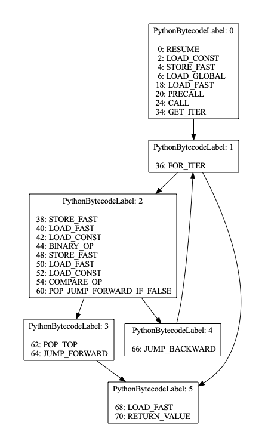
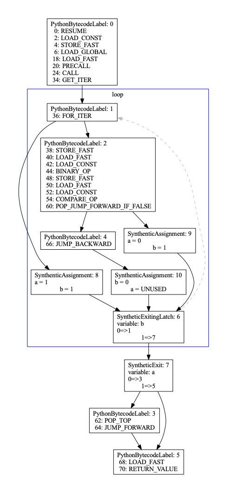
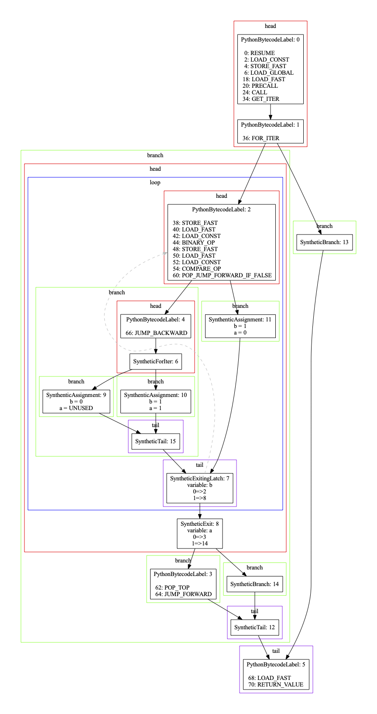

# numba-rvsdg

Numba compatible RVSDG (Regionalized Value State Dependence Graph)  utilities.

## about

This repository contains Numba compatible utilities for working with RVSDGs
(Regionalized Value State Dependency Graphs). RVSDGs are a type of
Intermediary Representation (IR) suitable for regularizing Python bytecode
within Numba.

The code in this repository is an implementation of the CFG restructuring
algorithms in Bahmann 2015, specifically those from section 4.1 and 4.2: namely
"loop restructuring" and "branch restructuring". These are interesting for
Numba because they serve to clearly identify regions within the Python
bytecode.

## dependencies

* Python 3.11
* graphviz
* pyyaml

You can create a conda env using the following:

```
conda env create -n numba-rvsdg python=3.11 python-graphviz
conda activate numba-rvsdg
pip install pyyaml
```

At the time of writing `pyyaml` was not available for Python 3.11 via
`defaults` so it had to be installed with `pip`.

## overview

The following files are included in this repository:

```
numba_rvsdg
├── __init__.py
├── core
│   ├── datastructures
│   │   ├── basic_block.py  # BasicBlock implementation
│   │   ├── scfg.py         # SCFG implementation, maps names to blocks
│   │   ├── byte_flow.py    # ByteFlow implementation, SCFG + bytecode
│   │   ├── flow_info.py    # Converts program to ByteFlow
│   ├── transformations.py  # Algorithms
│   └── utils.py            # Miscellaneous utilities
├── networkx_vendored
│   └── scc.py              # Strongly Connected Componets (loop detection)
├── rendering
│   └── rendering.py        # Graphivz based rendering of SCFGs
├── tests
│   ├── simulator.py        # Simulator utility for running SCFGs
│   ├── test_byteflow.py    # Testung ByteFlow and others
│   ├── test_fig3.py        # Testing fig. 3 from Bahman2015
│   ├── test_fig4.py        # Testing fig. 4 from Bahman2015
│   ├── test_simulate.py    # Simulator based testing
│   └── test_transforms.py  # Testing graph transformations
└── utils
```

## example

The following will process the given example function and display the four
different stages. "initial" is the unprocessed bytecode as produced by
cpython. "closed" is simply the closed variant of the initial CFG. "loop
restructuring" is the loop-restructured version and "branch-restructured" is
the final form which includes closing, loop-restructuring and
branch-restructuring.


```python
# Example: for loop with branch and early exit

from numba_rvsdg.rendering.rendering import render_func

def foo(n):
    c = 0
    for i in range(n):
        c += 1
        if i == 100:
            break
    return c

render_func(foo)

```






## references

* `Reismann2020` -- https://arxiv.org/pdf/1912.05036.pdf -- Describes the concept of RVSDGs
* `Bahmann2015` -- https://dl.acm.org/doi/pdf/10.1145/2693261 -- Describes the transformation
  algorithms implemented

## license

Copyright (c) 2022, Anaconda, Inc.
All rights reserved.

Redistribution and use in source and binary forms, with or without
modification, are permitted provided that the following conditions are
met:

Redistributions of source code must retain the above copyright notice,
this list of conditions and the following disclaimer.

Redistributions in binary form must reproduce the above copyright
notice, this list of conditions and the following disclaimer in the
documentation and/or other materials provided with the distribution.
THIS SOFTWARE IS PROVIDED BY THE COPYRIGHT HOLDERS AND CONTRIBUTORS
"AS IS" AND ANY EXPRESS OR IMPLIED WARRANTIES, INCLUDING, BUT NOT
LIMITED TO, THE IMPLIED WARRANTIES OF MERCHANTABILITY AND FITNESS FOR
A PARTICULAR PURPOSE ARE DISCLAIMED. IN NO EVENT SHALL THE COPYRIGHT
HOLDER OR CONTRIBUTORS BE LIABLE FOR ANY DIRECT, INDIRECT, INCIDENTAL,
SPECIAL, EXEMPLARY, OR CONSEQUENTIAL DAMAGES (INCLUDING, BUT NOT
LIMITED TO, PROCUREMENT OF SUBSTITUTE GOODS OR SERVICES; LOSS OF USE,
DATA, OR PROFITS; OR BUSINESS INTERRUPTION) HOWEVER CAUSED AND ON ANY
THEORY OF LIABILITY, WHETHER IN CONTRACT, STRICT LIABILITY, OR TORT
(INCLUDING NEGLIGENCE OR OTHERWISE) ARISING IN ANY WAY OUT OF THE USE
OF THIS SOFTWARE, EVEN IF ADVISED OF THE POSSIBILITY OF SUCH DAMAGE.


